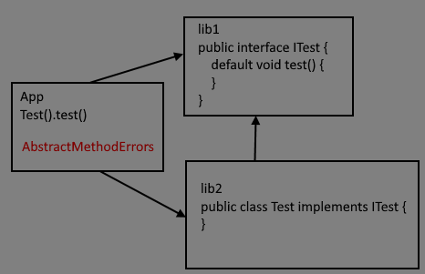

# PoC_AME_java_default_method
Proof of concept `AbstractMethodError` when use java 8 default interface methods and implementation in different libs

steps s to reproduce:
1. Clone the project and build it by with Android Studio.
2. Make APK. It is important to build apk by `Build-Generate Signed Bundle / APK` or `Build-Build Bundles / APK` menu command (not simply run from Android Studio).
3. Setup apk on a device and run.
4. Check Logcat for `PoC_AME_LOG` logs like:
   
   `D/PoC_AME_LOG: call failed = java.lang.AbstractMethodError: abstract method "void com.test.interface lib.ITest.test()"`

note:
- Error occurs when interface and implementation use Java source code and placed in different libraries only
- If we use Kotlin for interface and implementation the error is disappeared